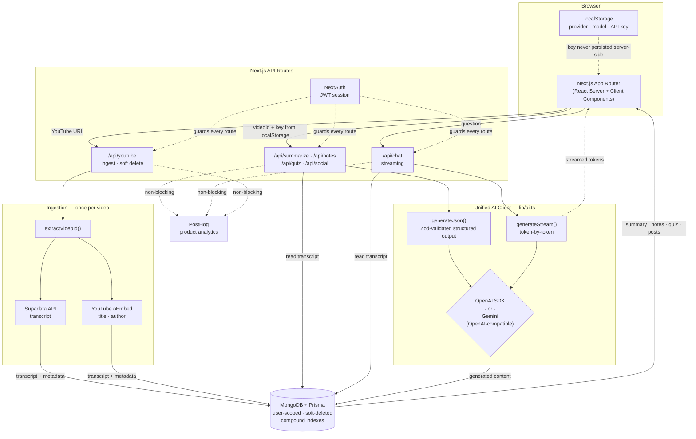

# uToob AI

Turn any YouTube video into a summary, structured notes, a quiz, social posts, and a conversation you can search — powered by your own AI provider key.

The transcript is fetched **once** at ingestion and reused by every feature, so generating a summary, a quiz, and a chat reply never re-downloads the same video.

---

## Architecture

The system runs in two phases: a one-time **ingestion** per video, then **AI generation** per request.



### Design decisions

| Decision | Why |
|---|---|
| **Transcript fetched once** | Ingestion stores it in MongoDB; all five features read the same row. No repeat calls to Supadata. |
| **Keys stored client-side** | API keys live in `localStorage` and travel per-request. Never written to the database. |
| **OpenAI-compatible Gemini** | Gemini is reached through its OpenAI-compatible endpoint, so one client covers both providers and models stay swappable. |
| **Zod-validated output** | Notes and quizzes use structured output parsed against a schema, so malformed AI responses fail loudly instead of rendering broken UI. |
| **Chat streams** | Chat replies stream token-by-token; the other features return complete JSON. |
| **Social generated in parallel** | LinkedIn and X posts are generated concurrently via `Promise.all`. |
| **Soft deletes** | Nothing is hard-deleted. Every query filters `deleted: false` and is scoped to `userId`. |
| **Non-blocking analytics** | PostHog events are batched and flushed fire-and-forget, so analytics never adds latency to a response. |

---

## Features

- **Summaries** — overview, key points, deep insights, takeaways, and quotable lines
- **Structured notes** — headed sections with bullets, ready for Notion or Obsidian
- **Quizzes** — multiple-choice questions with explanations, one at a time, scored as you go
- **Chat** — ask follow-up questions, answered from the transcript and streamed back
- **Social posts** — hook-driven drafts for LinkedIn and X
- **Bring your own key** — Google Gemini supported today; provider and model are switchable in Settings
- **Light and dark themes**, responsive down to 320px

## Tech stack

| Layer | Choice |
|---|---|
| Framework | Next.js 14 (App Router) |
| Language | TypeScript |
| Styling | Tailwind CSS, Radix UI |
| Database | MongoDB |
| ORM | Prisma |
| Auth | NextAuth.js (Credentials, JWT sessions) |
| AI | OpenAI SDK — targets OpenAI and Gemini's OpenAI-compatible endpoint |
| Validation | Zod |
| Transcripts | Supadata API |
| Analytics | PostHog |

---

## Getting started

### 1. Install

```bash
npm install
```

### 2. Environment variables

Create a `.env` file in the project root:

```env
# MongoDB connection string
DATABASE_URL="mongodb+srv://<username>:<password>@cluster.mongodb.net/utube-ai?retryWrites=true&w=majority"

# NextAuth
NEXTAUTH_URL="http://localhost:3000"
NEXTAUTH_SECRET="generate-with-openssl-rand-base64-32"

# Supadata — YouTube transcripts (https://dash.supadata.ai)
SUPADATA_API_KEY="your_supadata_api_key"

# PostHog — optional; analytics degrade gracefully if unset
NEXT_PUBLIC_POSTHOG_KEY=""
NEXT_PUBLIC_POSTHOG_HOST="https://us.i.posthog.com"
```

Your **AI provider key is not an environment variable** — add it in the app under Settings. It stays in your browser.

### 3. Database

```bash
npx prisma db push    # creates collections and indexes
npx prisma generate
```

> `db push` is what creates the compound indexes on MongoDB. Run it against **every** environment — editing `schema.prisma` alone has no effect on a database you haven't pushed to.

### 4. Run

```bash
npm run dev
```

Open [http://localhost:3000](http://localhost:3000), create an account, then add your Gemini key in Settings before generating anything.

---

## Project layout

```
app/
  api/            route handlers — auth, ingest, and one per AI feature
  dashboard/      library grid and settings
  video/[id]/     two-pane reader: artifact rail + tab panels
components/
  layout/         app shell, sidebar, auth layout
  ui/             primitives — button, card, toast, badge, select…
lib/
  ai.ts           unified client: generateJson, generateStream
  config.ts       app name, model list, prompts, limits
  schemas.ts      Zod schemas for structured output
  youtube.ts      video ID extraction, transcript, oEmbed metadata
prisma/
  schema.prisma   models and compound indexes
```

## Configuration

Prompts, model lists, and limits live in `lib/config.ts`. You can change the AI output style or add a model without touching the API routes.

## Scripts

```bash
npm run dev           # development server
npm run build         # production build
npm run start         # serve the production build
npm run lint          # eslint
npm run check-types   # tsc --noEmit
```
